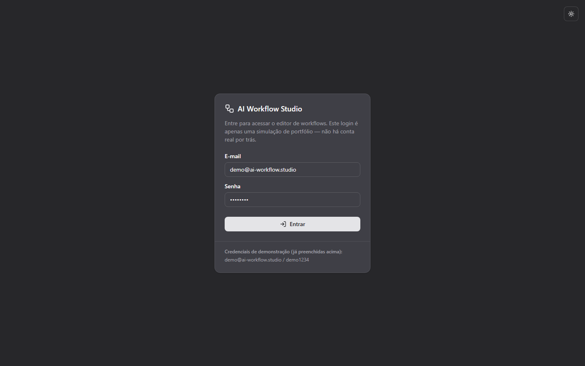
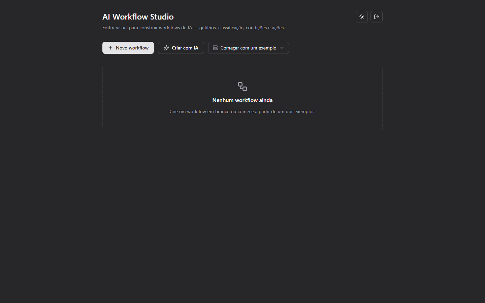
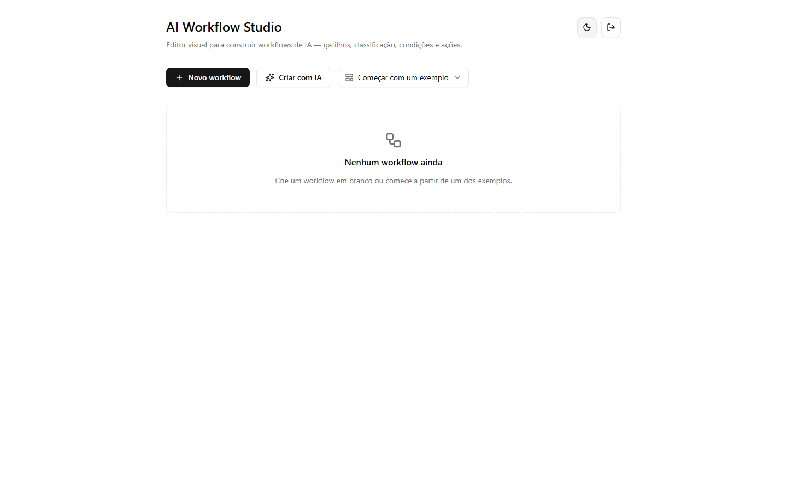
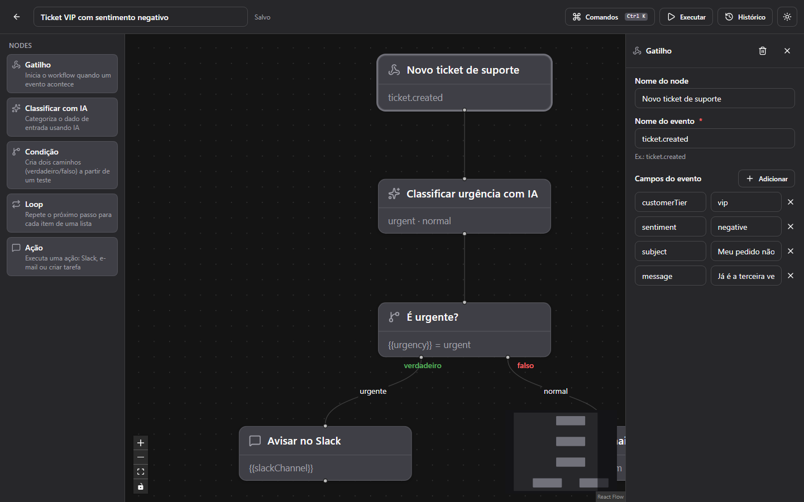
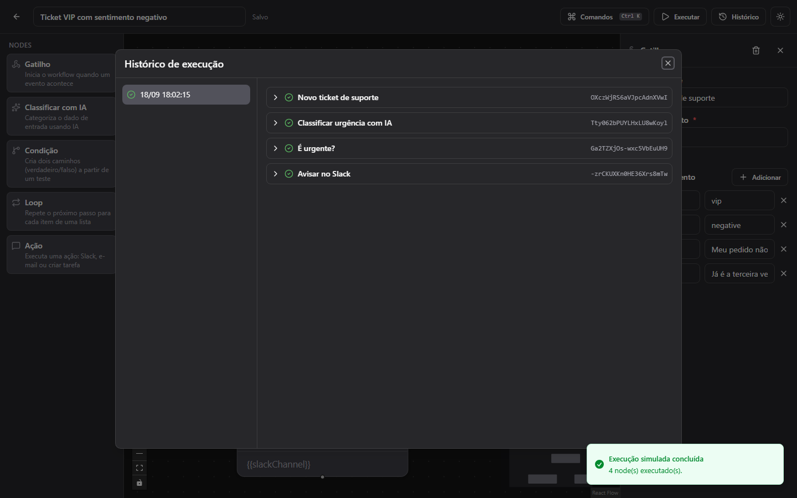
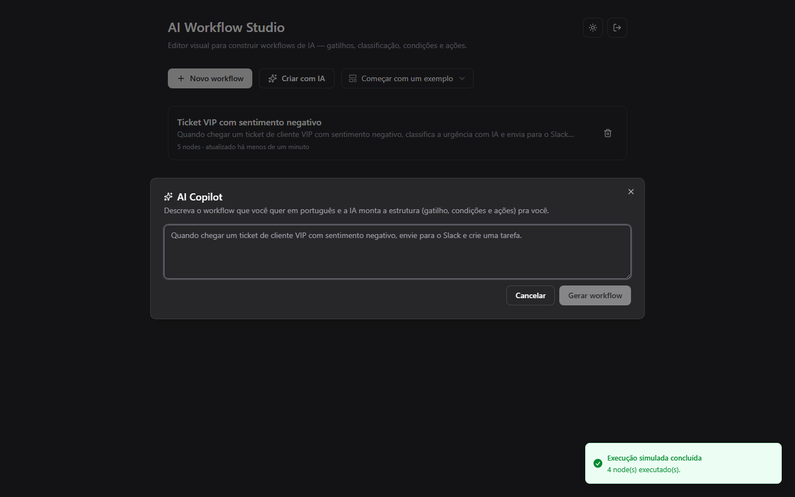

# AI Workflow Studio

## O que é este projeto?

Imagine uma tela onde você monta, arrastando caixinhas com o mouse, uma
"receita" de automação: *"quando isso acontecer, faça aquilo"*. Por exemplo:
*"quando um cliente cancelar um pedido, use IA para avaliar a urgência e, se
for alta, avise o time no Slack"*. É exatamente isso que este projeto faz —
um editor visual de workflows (fluxos de trabalho) de IA, no estilo de
ferramentas como n8n ou Zapier, construído do zero em React.

Você conecta blocos visuais ("nodes") como *gatilho* → *classificar com IA*
→ *condição* → *ação*, roda uma simulação do fluxo e acompanha o resultado
passo a passo — com histórico, gráfico de duração e o retorno de cada etapa.
Também é possível descrever o workflow em português normal (ex.: *"quando um
cliente cancela, notifica o time no Slack"*) e deixar a IA montar a
estrutura sozinha.

**Importante:** este é um projeto de portfólio, para demonstrar habilidades
técnicas — não é um produto real à venda. Não há dados de clientes de
verdade, não há integração real com Slack/e-mail/etc., e a execução dos
workflows é sempre simulada. O login também é uma simulação (ver seção
"Acesso" abaixo): não existe um banco de usuários por trás, é só para
mostrar a tela.

## Veja funcionando

- **Repositório:** [github.com/saullobueno/ai-workflow-studio](https://github.com/saullobueno/ai-workflow-studio)
- **Demo ao vivo:** [ai-workflow-studio-phi.vercel.app](https://ai-workflow-studio-phi.vercel.app/)

### Acesso

A tela inicial pede um login simulado — sem cadastro, sem conta real. As
credenciais de demonstração já vêm preenchidas nos campos e também aparecem
no rodapé do próprio card de login:

```
E-mail: demo@ai-workflow.studio
Senha:  demo1234
```

Basta clicar em "Entrar".

### Roteiro de 3 minutos

1. **Login** — entre com as credenciais de demonstração (já preenchidas).
2. **Tela inicial** — escolha um dos 5 exemplos no seletor "Começar com um
   exemplo" (ou crie um workflow em branco). No canto superior direito dá
   pra alternar entre modo claro e escuro.
3. **Canvas do editor** — arraste um node novo da paleta lateral até o
   canvas, conecte-o a um node existente e clique nele para abrir o painel
   de configuração.
4. **Command palette** — abra com `Ctrl+K`/`⌘K`, adicione um node por ali e
   desfaça/refaça a alteração (undo/redo vive na própria palette, sem tirar
   a mão do teclado).
5. **Executar** — rode o workflow simulado e explore o histórico: log por
   node, gráfico de duração (ECharts) e o JSON Inspector (Monaco) de entrada
   e saída de cada passo.
6. **AI Copilot** — descreva um workflow em português (ex.: "Quando um
   cliente cancela, notifica o time no Slack") e veja a IA montar a
   estrutura sozinha.

### Capturas de tela

| Login (dark) | Lista de workflows (dark) |
| --- | --- |
|  |  |

| Lista de workflows (light) | Editor do canvas (dark) |
| --- | --- |
|  |  |

| Histórico de execução (dark) | AI Copilot (dark) |
| --- | --- |
|  |  |

### Sinais técnicos que o projeto demonstra

- **Estado complexo de UI**: canvas do React Flow orquestrado com Zustand +
  `zundo`, incluindo agrupamento de gestos de drag inteiros em um único
  passo de undo/redo.
- **Validação como fonte única de verdade**: todos os schemas em Zod,
  compartilhados entre o app e a função serverless — o mesmo schema valida
  formulário, autosave e a saída estruturada da IA.
- **Interação acessível**: drag-and-drop com fallback completo por
  clique/teclado e command palette navegável sem mouse.
- **Integração de IA com geração estruturada**: Vercel AI SDK + Groq (tier
  gratuito) atrás de uma única função serverless — a chave de API nunca
  chega ao navegador, e a saída é forçada a bater com o schema Zod do
  domínio.
- **Motor de execução simulado e observável**: log por node, visualização de
  duração (ECharts) e inspeção de payload (Monaco), sem depender de nenhuma
  integração real por trás.
- **Disciplina de qualidade**: TypeScript em modo estrito, Vitest + Testing
  Library, Playwright E2E e CI (GitHub Actions) rodando tudo a cada push.
- **Arquitetura documentada**: decisões não óbvias registradas como ADRs em
  [`docs/decisions/`](./docs/decisions/), não perdidas em histórico de chat.
- **Zero custo operacional**: SPA estática + 1 função serverless, tudo em
  planos gratuitos (Vercel Hobby, Groq free tier) — sem banco de dados, sem
  infraestrutura própria.

## Funcionalidades

- Login simulado (sem backend), com credenciais de demonstração já
  preenchidas
- Dark mode com paleta derivada de `#27272A`, alternável a qualquer momento
- Canvas infinito com zoom/pan/minimap (React Flow)
- 5 tipos de node (gatilho, classificar com IA, condição, loop, ação — com 3
  subtipos: Slack/e-mail/criar tarefa), cada um com painel de configuração
  próprio
- Paleta de nodes com drag-and-drop nativo e fallback por clique/teclado
- Undo/redo (com agrupamento de gestos de drag em um único passo)
- Autosave em `localStorage`
- Command palette (Ctrl+K) para adicionar nodes e executar ações sem tirar a
  mão do teclado
- Execução simulada com histórico, log por node, gráfico de duração e JSON
  Inspector (Monaco) de entrada/saída de cada passo
- Templates iniciais (o exemplo do ticket VIP deste README) e AI Copilot:
  descreva o workflow em português e a IA (Groq, gratuito) monta a estrutura

## Stack

- React 19 + TypeScript (modo estrito) + Vite
- [React Flow](https://reactflow.dev/) (`@xyflow/react`) para o canvas do
  editor
- Zustand + `zundo` (undo/redo) para o estado do editor
- TanStack Query para o estado assíncrono do AI Copilot
- Zod para todos os schemas (validação de formulário e do endpoint de IA)
- Tailwind CSS v4 + shadcn/ui (Radix UI)
- Monaco Editor (JSON Inspector) e ECharts (estatísticas de execução)
- Vercel AI SDK + Groq (AI Copilot, tier gratuito), rodando atrás de uma
  função serverless
- Vitest + Testing Library (unitário/integração) e Playwright (E2E)

Arquitetura: SPA (Vite) com uma única função serverless (`api/copilot.ts`,
padrão Vercel) fazendo proxy da chamada ao provedor de IA — a chave de API
nunca chega ao navegador. Não há banco de dados: workflows, histórico de
execução e a sessão do login simulado ficam no `localStorage`, atrás de uma
camada de abstração central. Execução de workflow é sempre simulada (sem
integrações reais com Slack/e-mail/etc.).

Decisões de arquitetura e domínio que não vieram de uma especificação
explícita estão documentadas em [`docs/decisions/`](./docs/decisions/).

## Pré-requisitos

- Node.js 24+
- Uma chave de API da Groq, gratuita e sem cartão de crédito (opcional para
  rodar o editor; necessária só para usar o AI Copilot) — veja `.env.example`

## Como rodar

```bash
npm install
cp .env.example .env   # preencha GROQ_API_KEY se for usar o AI Copilot
npm run dev
```

## Scripts

| Comando                 | O que faz                                            |
| ----------------------- | ---------------------------------------------------- |
| `npm run dev`           | Servidor de desenvolvimento (Vite + proxy do `/api`) |
| `npm run build`         | Typecheck + build de produção                        |
| `npm run preview`       | Serve o build de produção localmente                 |
| `npm run lint`          | ESLint                                               |
| `npm run lint:fix`      | ESLint com autofix                                   |
| `npm run format`        | Prettier (escreve)                                   |
| `npm run format:check`  | Prettier (só verifica)                               |
| `npm run typecheck`     | `tsc` sem emitir arquivos                            |
| `npm run test`          | Testes unitários/integração (Vitest)                 |
| `npm run test:watch`    | Vitest em modo watch                                 |
| `npm run test:coverage` | Vitest com cobertura                                 |
| `npm run test:e2e`      | Testes end-to-end (Playwright)                       |

## Deploy

Alvo de deploy: [Vercel](https://vercel.com) (plano Hobby, gratuito) — a SPA
é servida como estático e `api/copilot.ts` roda como Vercel Function
(runtime Node.js). Configure `GROQ_API_KEY` nas variáveis de ambiente do
projeto na Vercel.

## Desenvolvendo com um agente de código

Este repositório tem um workspace de IA completo (`CLAUDE.md`, subagents,
skills, hooks e comandos em `.claude/`) — comece por `CLAUDE.md` se for
editar o código com um agente.

## CI

GitHub Actions (`.github/workflows/ci.yml`) roda lint, typecheck, testes
unitários (com cobertura), build e testes E2E a cada push/PR.
